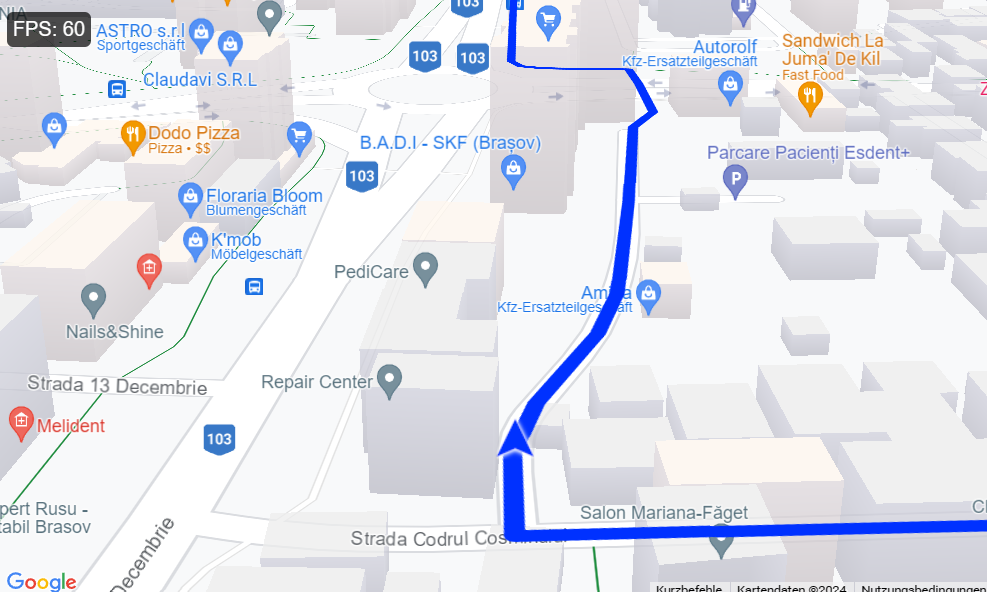

# gmaps Javascript routing playground

This is a minimal navogation project to see how far one can go using gmaps API & standard/cheap hardware. The goal is to run a fully working routing application on a Raspberry Pi Zero 2 (~$15) with convenient performance using web technologies where everything (screen + board) is powered by a battery.

See the **demo**:

## Background

Sample route that was used:

https://maps.app.goo.gl/CYG3nEqdHmXxGRoQA

For decoding & polyline generation see `python`.

For web frontend see `web`. Run this locally via

    cd web
    busybox httpd -f -p 8080 &

Browser is the default [chromium](https://www.chromium.org/Home/), I also tried [cog](https://github.com/Igalia/cog) but the performance difference was negligible.

# Results

When measuring frames per second the Zero 2 achieved satisfying 40-60 fps.

Measuring power consumption resulted in the following:

Raspberry Pi Zero 2 idle: 0.145A
External display w. 800*480 resolution: 0.29A
Raspberry Pi Zero 2 with routing benchmark running: 0.26A

For testing and measuring I used a UM34 USB meter and a 2500mAh LiPo battery (approx. $15).

So in total this means when routing I ended up with an average power consumption of ~0.6A. Using my battery this would lead to a max runtime of approx. 5 hours.

## Limits

The performance of the Raspberry Pi seems to be insufficient for advanced Google Maps features based on WebGL like [change of heading](https://developers.google.com/maps/documentation/javascript/webgl/tilt-rotation) or [vector maps](https://developers.google.com/maps/documentation/javascript/vector-map) in general for some kind of 3D view. This worked on "faster" machines where the route then looked like this which is much closer to an actual navigation system:

